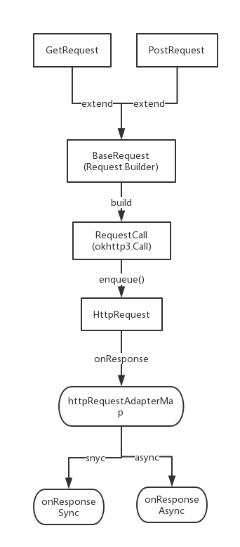

## HttpRequest

-------

###  整体思想:

### example code:
1.建议在AppLication onCreate注册 对应模块的请求适配器 
 HttpRequest.registerAdapter(new YourRequestAdapter())
2.建议每个模块继承requestAdapter实现自己底层的业务逻辑数据处理，将干净的数据抛给上层。
3.get 请求 :  
    
     HttpRequest.get()
                .url(URl)
                .param("key", "value")
                .build()
                .enqueue(MediaResponse.class, new HttpCallback<MediaResponse>() {
                    @Override
                    public void onSucceed(MediaResponse data) {
                        Logger.d("get request is success ");
                    }

                    @Override
                    public void onFailed(HttpError error) {
                        Logger.e(error.toString());
                    }
                });  
            
4.post请求

          HttpRequest.post()
                .url(URl)
                .param("key","value")
                .body("key", "value")
                .build()
                .enqueue(MediaResponse.class, new HttpCallback<MediaResponse>() {
                    @Override
                    public void onSucceed(MediaResponse data) {
                        Logger.d("post request is success");
                    }

                    @Override
                    public void onFailed(HttpError error) {
                        Logger.e(error.toString());
                    }
                });
                

